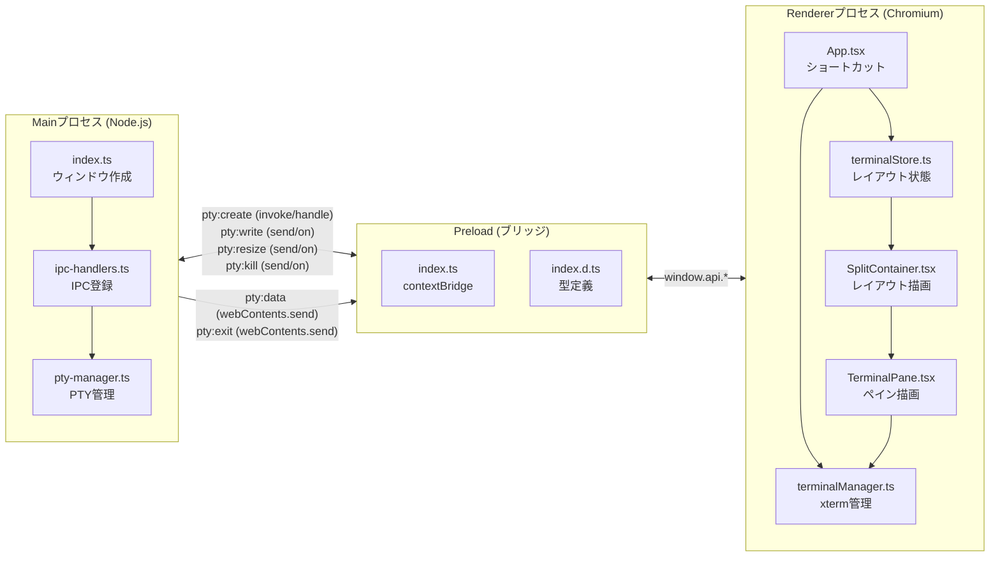
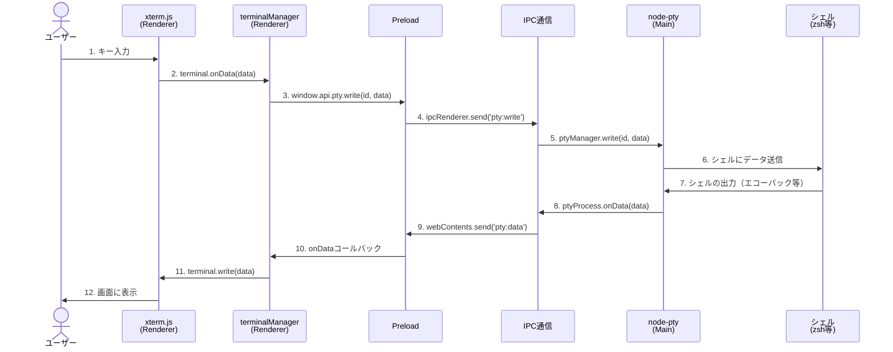
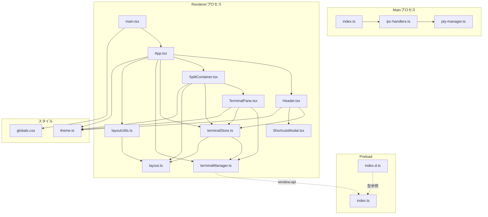

# 全体アーキテクチャ概要

> **前提知識**: [02-electron-basics.md](./02-electron-basics.md) でElectronの3プロセスモデルとIPC通信を理解していること
>
> **関連ドキュメント**: [03-data-flow.md](./03-data-flow.md) | [04-layout-and-state.md](./04-layout-and-state.md) | [05-advanced-features.md](./05-advanced-features.md)

---

## Terminal Divisionとは

Terminal Divisionは、macOS向けのターミナル分割アプリケーションです。iTerm2のようなペイン分割機能をElectron + React + TypeScriptで実現しています。

### 技術スタック

| カテゴリ | 技術 | バージョン |
|---------|------|-----------|
| フレームワーク | Electron | 33.x |
| ビルドツール | electron-vite (Vite) | 2.x |
| フロントエンド | React + TypeScript | React 18.x / TS 5.x |
| ターミナル描画 | xterm.js | 5.5.x |
| ターミナルバックエンド | node-pty | 1.x |
| 状態管理 | Zustand | 5.x |
| レイアウト | react-resizable-panels | 4.x |
| プラグイン | @vitejs/plugin-react | 4.x |

---

## プロジェクト構成

```
terminal-division/
├── electron.vite.config.ts        # electron-viteのビルド設定
├── package.json                   # 依存関係とスクリプト
├── src/
│   ├── main/                      # === Mainプロセス ===
│   │   ├── index.ts               # アプリエントリ、ウィンドウ作成
│   │   ├── ipc-handlers.ts        # IPCハンドラー登録（8チャネル）
│   │   └── pty-manager.ts         # PTYプロセス管理（生成/書込/リサイズ/終了）
│   │
│   ├── preload/                   # === Preloadスクリプト ===
│   │   ├── index.ts               # contextBridgeによるAPI公開
│   │   └── index.d.ts             # window.apiの型定義
│   │
│   └── renderer/                  # === Rendererプロセス ===
│       ├── main.tsx               # Reactエントリポイント
│       ├── App.tsx                # ルートコンポーネント、ショートカットキー
│       ├── components/
│       │   ├── Header.tsx         # ヘッダーバー（分割/閉じるボタン等）
│       │   ├── SplitContainer.tsx # レイアウト再帰レンダリング
│       │   ├── TerminalPane.tsx   # 個別ターミナルペイン
│       │   └── ShortcutsModal.tsx # ショートカット一覧モーダル
│       ├── services/
│       │   └── terminalManager.ts # xterm.jsインスタンス管理（ライフサイクル全体）
│       ├── stores/
│       │   └── terminalStore.ts   # Zustandストア（レイアウト二分木）
│       ├── types/
│       │   └── layout.ts          # レイアウト型定義（TerminalPane / SplitNode）
│       ├── utils/
│       │   └── layoutUtils.ts     # レイアウトユーティリティ関数
│       └── styles/
│           ├── theme.ts           # テーマ定数（色、スペーシング）
│           └── globals.css        # グローバルCSS（タイトルバー、スクロールバー等）
```

> **Note:** 全19ソースファイルで構成されるコンパクトなコードベースです。Rendererプロセスに13ファイル、Mainプロセスに3ファイル、Preloadに2ファイル、ルートに1ファイル（ビルド設定）という配分です。

---

## 3プロセスモデル全体図

Terminal Divisionのアーキテクチャを、3つのElectronプロセスとそれぞれの担当ファイル、IPCチャネルとともに図示します。



---

## 主要ライブラリと役割

| ライブラリ | 役割 | 使用プロセス | 使用箇所 |
|-----------|------|-------------|---------|
| **xterm.js** | ターミナルのUIレンダリング。VT100エスケープシーケンスの解析・描画 | Renderer | `terminalManager.ts` |
| **@xterm/addon-fit** | ターミナルをコンテナサイズに自動フィット | Renderer | `terminalManager.ts` |
| **@xterm/addon-web-links** | ターミナル内URLをクリック可能にする | Renderer | `terminalManager.ts` |
| **node-pty** | 擬似端末（PTY）の生成。実際のシェルプロセスとのI/O | Main | `pty-manager.ts` |
| **Zustand** | 軽量な状態管理。レイアウトの二分木データを保持 | Renderer | `terminalStore.ts` |
| **react-resizable-panels** | ドラッグ可能なパネル分割UI | Renderer | `SplitContainer.tsx` |
| **electron-vite** | Electronアプリ用のViteベースビルドツール | ビルド | `electron.vite.config.ts` |
| **@electron-toolkit/utils** | Electron開発ユーティリティ（ショートカット監視等） | Main | `index.ts` |

> **Note:** `node-pty`はネイティブモジュール（C++バインディング）のため、`electron.vite.config.ts:10`で`external`指定されています。Viteのバンドルから除外し、Electronのネイティブモジュールローダーで読み込みます。

---

## データの全体的な流れ（概要）

ユーザーがキーボードでキーを打ってから、その結果が画面に表示されるまでの基本的な往復フローです。詳細は [03-data-flow.md](./03-data-flow.md) で解説します。



**ポイント:**
- ステップ1-6が「入力パス」（Renderer → Main → シェル）
- ステップ7-12が「出力パス」（シェル → Main → Renderer）
- シェルのエコーバック（入力した文字がそのまま返ってくる）により、入力文字が画面に表示される

---

## ファイル間の依存関係

ソースファイル間のimport関係を可視化します。矢印は「AがBをimportしている」ことを示します。



**依存関係の特徴:**
- `terminalManager.ts`は最も多くの責務を持つファイル（xterm.js管理、IME処理、Undo/Redo、IPC通信）
- `terminalStore.ts`は`terminalManager.ts`に依存（closeTerminal時のクリーンアップ）
- `layout.ts`は型定義のみで、他のファイルに依存しない純粋な型モジュール
- Main / Preload / Renderer間の直接import関係はなく、全てIPC通信で接続される

---

## 開発コマンド

```bash
npm run dev        # 開発モード（electron-vite dev、ホットリロード対応）
npm run build      # プロダクションビルド（electron-vite build）
npm run preview    # ビルド結果のプレビュー
```

### パスエイリアス

`electron.vite.config.ts:19-21`で設定:
```
@ → src/renderer/
```
Rendererプロセスのファイルを`@/components/TerminalPane`のように参照できます。

---

## 次に読むべきドキュメント

- [04-layout-and-state.md](./04-layout-and-state.md) — レイアウト二分木と状態管理の詳細（**重点**）
- [03-data-flow.md](./03-data-flow.md) — ターミナルの作成から破棄までのデータフロー（**重点**）
- [05-advanced-features.md](./05-advanced-features.md) — Undo/Redo、IME、ショートカットの実装詳細
