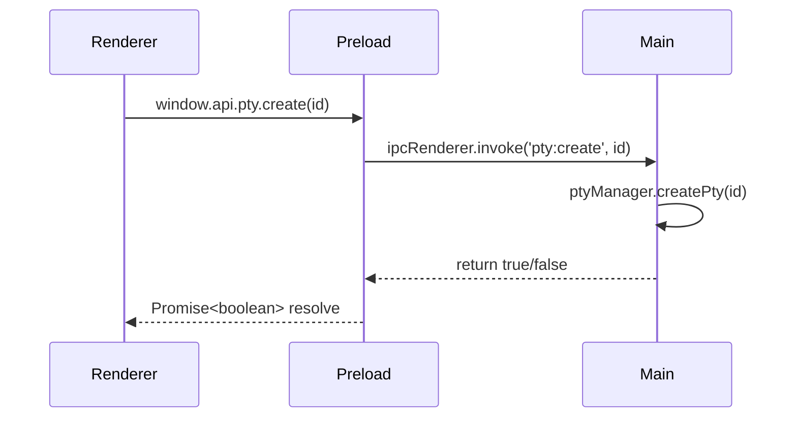
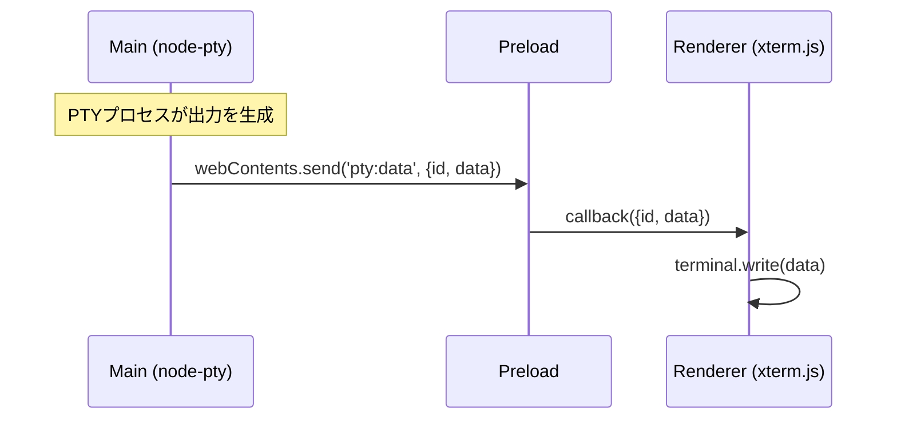

# Electron基礎解説

> **前提知識**: なし（本ドキュメントが最初に読むべきファイルです）
>
> **関連ドキュメント**: [01-architecture-overview.md](./01-architecture-overview.md) | [03-data-flow.md](./03-data-flow.md)

---

## Electronとは何か

ElectronはChromium（Webブラウザエンジン）とNode.js（サーバーサイドJavaScript）を組み合わせて、Web技術でデスクトップアプリケーションを構築するフレームワークです。

Terminal Divisionは、このElectronを使ってmacOS向けのターミナル分割アプリケーションを実現しています。HTML/CSS/ReactでUIを描画しつつ、Node.jsの`node-pty`モジュールで本物のシェルプロセス（zsh等）を起動できるのは、Electronならではの特徴です。

**Electronの構成要素:**

| 要素 | 役割 | Terminal Divisionでの用途 |
|------|------|--------------------------|
| Chromium | Webページのレンダリング | React + xterm.jsによるターミナルUI描画 |
| Node.js | ネイティブAPIアクセス | `node-pty`でシェルプロセス生成、ファイルシステムアクセス |
| Electron API | ウィンドウ管理、IPC等 | BrowserWindow、ipcMain/ipcRenderer、dialog |

---

## 3つのプロセス

Electronアプリは3種類のプロセスで構成されます。それぞれ実行環境とアクセスできるAPIが異なります。

### Mainプロセス（Node.js環境）

アプリ全体を管理する「バックエンド」です。1つのアプリにつき1つだけ存在します。

**できること:**
- ウィンドウ（BrowserWindow）の作成・管理
- ネイティブAPI（ファイルダイアログ、シェルコマンド等）へのアクセス
- `node-pty`によるPTY（擬似端末）プロセスの生成

**該当ファイル:**
- `src/main/index.ts` — アプリのエントリポイント、ウィンドウ作成
- `src/main/ipc-handlers.ts` — IPC通信のハンドラー登録
- `src/main/pty-manager.ts` — PTYプロセスの管理クラス

```typescript
// src/main/index.ts:6-22 — BrowserWindowの作成
const mainWindow = new BrowserWindow({
  width: 1200,
  height: 800,
  webPreferences: {
    preload: join(__dirname, '../preload/index.js'),
    sandbox: false,
    nodeIntegration: false,    // セキュリティ: Rendererからのnode直接アクセスを禁止
    contextIsolation: true     // セキュリティ: Preloadとコンテキストを分離
  }
})
```

### Rendererプロセス（Chromium環境）

Webページを表示する「フロントエンド」です。各BrowserWindowに1つずつ存在します。

**できること:**
- React / HTML / CSSによるUI描画
- xterm.jsによるターミナル描画
- `window.api`を通じたMainプロセスとの通信（Preload経由）

**できないこと:**
- Node.jsのAPIに直接アクセス（`contextIsolation: true`のため）
- ファイルシステムへの直接アクセス

**該当ファイル:**
- `src/renderer/main.tsx` — Reactのエントリポイント
- `src/renderer/App.tsx` — ルートコンポーネント、ショートカットキー処理
- `src/renderer/components/` — UIコンポーネント群
- `src/renderer/services/terminalManager.ts` — xterm.jsインスタンス管理
- `src/renderer/stores/terminalStore.ts` — Zustandによる状態管理

### Preloadスクリプト（ブリッジ）

MainとRendererの間に位置する「橋渡し役」です。Node.jsのAPIにアクセスできますが、Rendererに直接公開するのではなく、`contextBridge`を使って安全なAPIだけを選択的に公開します。

**該当ファイル:**
- `src/preload/index.ts` — API定義とcontextBridge
- `src/preload/index.d.ts` — 型定義（`window.api`の型）

```
┌─────────────────────────────────────────────────────┐
│  Electronアプリ                                      │
│                                                      │
│  ┌──────────────┐                ┌────────────────┐  │
│  │ Mainプロセス   │◄── IPC通信 ──►│ Preloadスクリプト│  │
│  │  (Node.js)   │               │  (ブリッジ)     │  │
│  │              │               │                │  │
│  │ - BrowserWindow              │ - contextBridge│  │
│  │ - node-pty   │               │ - ipcRenderer  │  │
│  │ - dialog     │               └───────┬────────┘  │
│  └──────────────┘                       │           │
│                                   window.api        │
│                                         │           │
│                                ┌────────▼────────┐  │
│                                │ Rendererプロセス   │  │
│                                │  (Chromium)      │  │
│                                │                  │  │
│                                │ - React          │  │
│                                │ - xterm.js       │  │
│                                │ - Zustand        │  │
│                                └─────────────────┘  │
└─────────────────────────────────────────────────────┘
```

---

## IPC通信の仕組み

IPC（Inter-Process Communication）は、MainプロセスとRendererプロセスの間でデータをやり取りする仕組みです。Terminal Divisionでは3つのIPCパターンを使用しています。

### パターン1: invoke / handle（リクエスト/レスポンス型）

Rendererから呼び出し、Mainが処理して結果を返す。**Promise**を返すため、非同期の結果を待てます。



**使用箇所:**

```typescript
// Renderer側（Preload経由）— src/preload/index.ts:16
create: (id: string): Promise<boolean> => ipcRenderer.invoke('pty:create', id)

// Main側 — src/main/ipc-handlers.ts:6-8
ipcMain.handle('pty:create', (_, id: string) => {
  return ptyManager.createPty(id)
})
```

### パターン2: send / on（一方向送信 — Renderer → Main）

Rendererから一方的にデータを送る。応答を待たない**Fire-and-Forget**パターンです。高頻度で送信されるキー入力データに適しています。

```typescript
// Renderer側 — src/preload/index.ts:17
write: (id: string, data: string): void => ipcRenderer.send('pty:write', { id, data })

// Main側 — src/main/ipc-handlers.ts:10-12
ipcMain.on('pty:write', (_, { id, data }) => {
  ptyManager.write(id, data)
})
```

### パターン3: webContents.send（一方向送信 — Main → Renderer）

Mainから能動的にRendererへデータを送る。PTYの出力データを画面に反映する際に使用します。

```typescript
// Main側 — src/main/pty-manager.ts:59-61
ptyProcess.onData((data) => {
  this.sendToRenderer('pty:data', { id, data })
  // → this.mainWindow.webContents.send('pty:data', { id, data })
})

// Renderer側（Preload経由）— src/preload/index.ts:21
onData: createIpcListener<{ id: string; data: string }>('pty:data')
```



---

## contextBridgeの役割

`contextBridge`は、Preloadスクリプトで定義したAPIをRendererプロセスの`window`オブジェクトに安全に公開する仕組みです。

### なぜ必要か

`contextIsolation: true`の設定により、PreloadスクリプトとRendererのJavaScriptコンテキストは完全に分離されています。Preloadで定義した変数や関数にRendererから直接アクセスすることはできません。`contextBridge.exposeInMainWorld`を使うことで、指定したAPIだけをRendererの`window`オブジェクトに注入できます。

### 実装

```typescript
// src/preload/index.ts:14-34
const api = {
  pty: {
    create: (id: string): Promise<boolean> => ipcRenderer.invoke('pty:create', id),
    write: (id: string, data: string): void => ipcRenderer.send('pty:write', { id, data }),
    resize: (id: string, cols: number, rows: number): void =>
      ipcRenderer.send('pty:resize', { id, cols, rows }),
    kill: (id: string): void => ipcRenderer.send('pty:kill', id),
    onData: createIpcListener<{ id: string; data: string }>('pty:data'),
    onExit: createIpcListener<{ id: string; exitCode: number }>('pty:exit')
  },
  dialog: {
    selectDirectory: (): Promise<string | null> =>
      ipcRenderer.invoke('dialog:selectDirectory')
  },
  shell: {
    openExternal: (url: string): Promise<boolean> =>
      ipcRenderer.invoke('shell:openExternal', url)
  }
}

contextBridge.exposeInMainWorld('api', api)
```

### API呼び出しの流れ


### 型安全性

`src/preload/index.d.ts`で`window.api`の型をグローバルに宣言しています。これにより、Rendererのコード全体で型チェックと補完が効きます。

```typescript
// src/preload/index.d.ts:1-7
import type { Api } from './index'

declare global {
  interface Window {
    api: Api  // Preloadで定義したapi変数の型がそのまま使われる
  }
}
```

---

## セキュリティモデル

Terminal Divisionでは、Electronのセキュリティベストプラクティスに従った設定を採用しています。

### contextIsolation: true

Preloadスクリプトのコンテキストを、Rendererのページコンテキストから分離します。これにより、Rendererのページ内スクリプト（万が一XSS攻撃を受けた場合など）がPreloadの`ipcRenderer`に直接アクセスすることを防ぎます。

### nodeIntegration: false

Rendererプロセスから`require('fs')`のようなNode.js APIの直接呼び出しを禁止します。全てのネイティブ機能は`window.api`を通じてのみアクセスできます。

### 最小限のAPI公開

`contextBridge`で公開するAPIは必要最小限に留めています:

| API | 用途 | 制限 |
|-----|------|------|
| `pty.create` | PTY作成 | ID指定のみ |
| `pty.write` | PTYへのデータ送信 | ID + 文字列のみ |
| `pty.resize` | PTYリサイズ | ID + cols/rowsのみ |
| `pty.kill` | PTY終了 | ID指定のみ |
| `pty.onData` | PTY出力受信 | コールバック登録のみ |
| `pty.onExit` | PTY終了通知 | コールバック登録のみ |
| `dialog.selectDirectory` | ディレクトリ選択 | ダイアログ表示のみ |
| `shell.openExternal` | 外部URL表示 | http/httpsのみ |

> **Note:** `shell.openExternal`は`src/main/ipc-handlers.ts:39`でURLスキームのバリデーション（`http://`または`https://`のみ許可）を行っています。これにより`file://`プロトコル等を悪用した攻撃を防いでいます。

---

## IPCチャネル一覧

Terminal Divisionで使用される全IPCチャネルの一覧です。

| チャネル名 | 方向 | パターン | 用途 | 定義元 |
|-----------|------|---------|------|--------|
| `pty:create` | Renderer → Main | invoke/handle | PTYプロセス作成 | `ipc-handlers.ts:6` |
| `pty:write` | Renderer → Main | send/on | PTYへのデータ送信 | `ipc-handlers.ts:10` |
| `pty:resize` | Renderer → Main | send/on | PTYのリサイズ | `ipc-handlers.ts:14` |
| `pty:kill` | Renderer → Main | send/on | PTYプロセス終了 | `ipc-handlers.ts:18` |
| `pty:data` | Main → Renderer | webContents.send | PTY出力データ受信 | `pty-manager.ts:60` |
| `pty:exit` | Main → Renderer | webContents.send | PTYプロセス終了通知 | `pty-manager.ts:64` |
| `dialog:selectDirectory` | Renderer → Main | invoke/handle | ディレクトリ選択ダイアログ | `ipc-handlers.ts:23` |
| `shell:openExternal` | Renderer → Main | invoke/handle | 外部URLを開く | `ipc-handlers.ts:38` |

### リスナー登録のヘルパー

Preloadスクリプトでは、`createIpcListener`ヘルパー関数を使って、Main → Renderer方向のIPCリスナーを統一的に登録しています。返り値のクリーンアップ関数を呼ぶことでリスナーを解除できます。

```typescript
// src/preload/index.ts:6-12
function createIpcListener<T>(channel: string) {
  return (callback: (data: T) => void): (() => void) => {
    const handler = (_: Electron.IpcRendererEvent, data: T): void => callback(data)
    ipcRenderer.on(channel, handler)
    return () => ipcRenderer.removeListener(channel, handler)
    //     ↑ クリーンアップ関数を返す（リスナー解除用）
  }
}
```

---

## まとめ

Terminal Divisionの全ての通信は、以下の3層を通過します:

1. **Renderer** (`window.api.*`) — UIからの操作やデータ受信
2. **Preload** (`ipcRenderer`) — IPC通信の橋渡し
3. **Main** (`ipcMain` / `ptyManager`) — ネイティブ処理の実行

次のドキュメント [01-architecture-overview.md](./01-architecture-overview.md) では、この3プロセスモデルを踏まえたアプリ全体のアーキテクチャを解説します。
