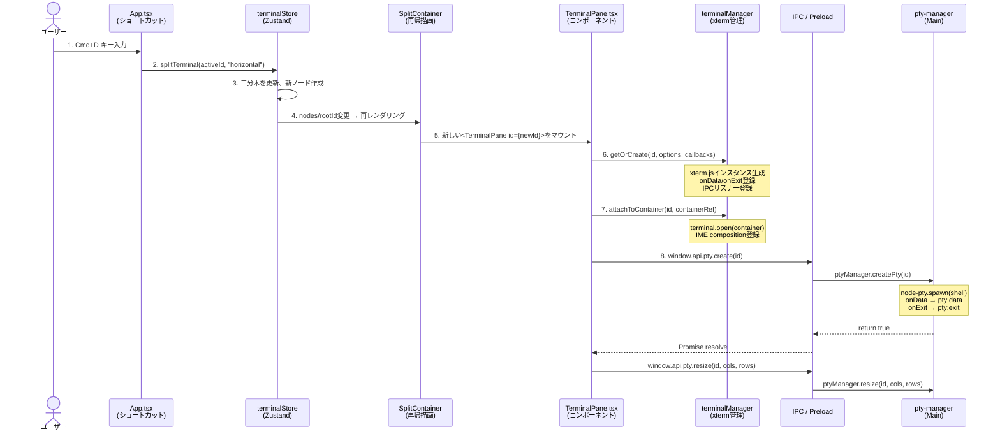
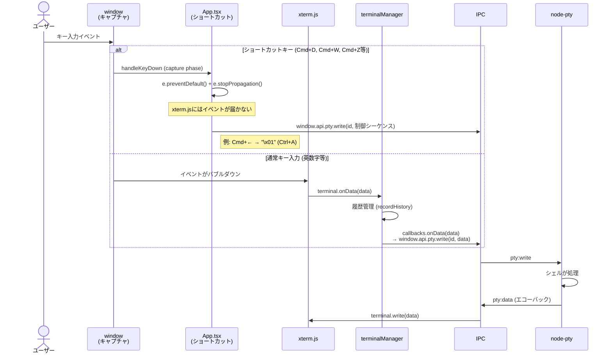
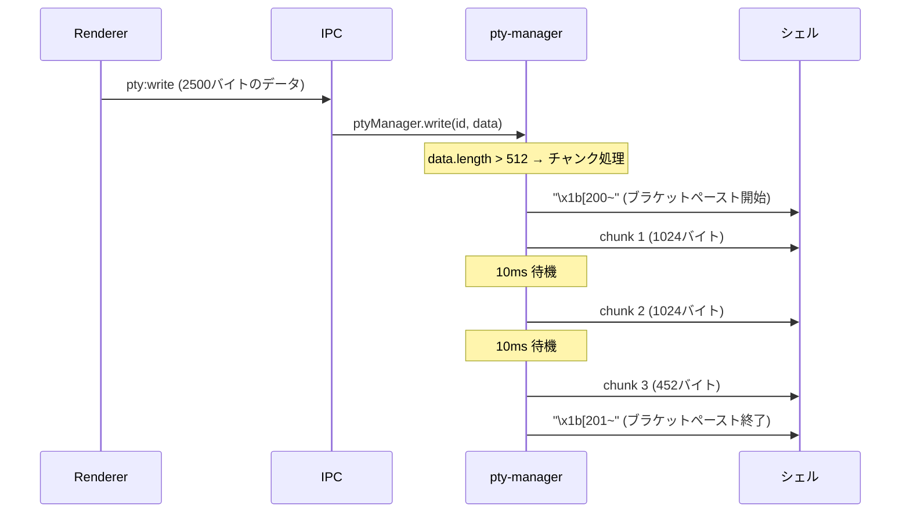
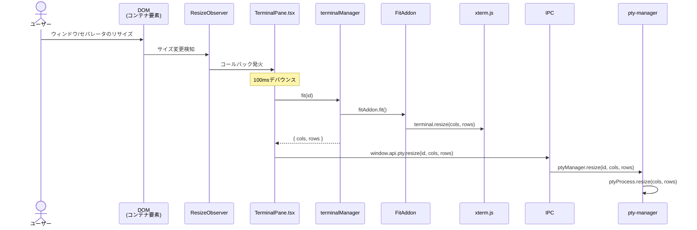
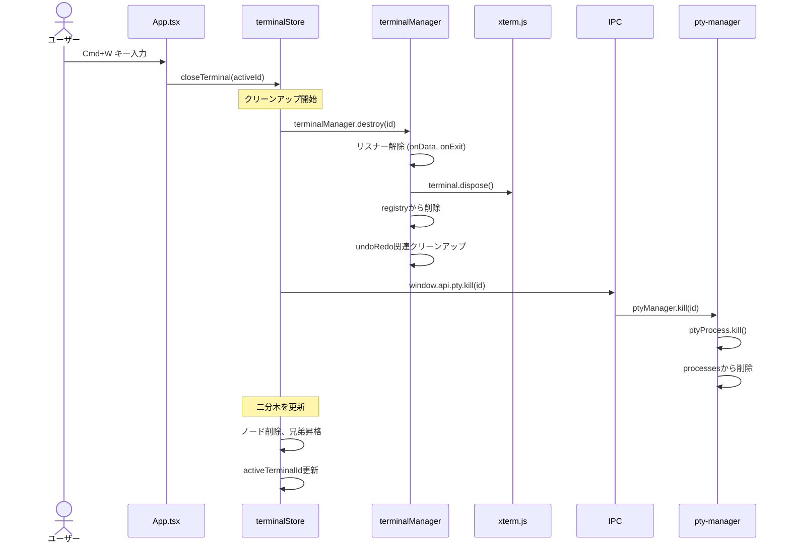

# データフロー詳細

> **前提知識**: [02-electron-basics.md](./02-electron-basics.md) / [01-architecture-overview.md](./01-architecture-overview.md) / [04-layout-and-state.md](./04-layout-and-state.md)
>
> **関連ドキュメント**: [05-advanced-features.md](./05-advanced-features.md)
>
> **本ドキュメントは重点領域です** — ターミナルの作成から破棄まで、アプリ内のデータがどのように流れるかを完全に追跡します。

---

## ターミナル作成フロー

ユーザーがCmd+Dで分割を実行してから、新しいターミナルが表示されてシェルが起動するまでの全ステップです。7つの参加者にまたがる8ステップのフローになります。



### 各ステップの詳細

**ステップ1: ショートカット検出** (`src/renderer/App.tsx:60-66`)

`window`の`keydown`イベントを**キャプチャフェーズ**で監視しています。xterm.jsより先にキーイベントを処理するためです。

```typescript
// src/renderer/App.tsx:264
window.addEventListener("keydown", handleKeyDown, true)
//                                                ^^^^ キャプチャフェーズ
```

**ステップ2-3: Zustandストアの更新** (`src/renderer/stores/terminalStore.ts:50-110`)

`splitTerminal()`が二分木を更新します。詳細は [04-layout-and-state.md](./04-layout-and-state.md) を参照。

**ステップ4-5: Reactの再レンダリング**

Zustandの`nodes`が変更されると、`SplitContainer`が再レンダリングされ、`renderNode()`の再帰処理で新しい`<TerminalPane>`がマウントされます。

**ステップ6: xterm.jsインスタンス生成** (`src/renderer/services/terminalManager.ts:48-258`)

`getOrCreate()`はインスタンスが既にある場合はそれを返し、なければ新規作成します。作成時に一度だけ以下を登録:
- `terminal.onData` — xterm.jsの入力イベントリスナー
- `window.api.pty.onData` — Main→Rendererの出力リスナー
- `window.api.pty.onExit` — PTY終了リスナー

**ステップ7: DOMアタッチ** (`src/renderer/services/terminalManager.ts:308-336`)

`attachToContainer()`で`terminal.open(container)`を呼び、xterm.jsをDOMに挿入します。初回アタッチ時にIMEのcompositionイベントリスナーも登録します。

**ステップ8: PTY生成** (`src/renderer/components/TerminalPane.tsx:62-86`)

`setTimeout(0)`でDOM描画完了後にPTYを生成します。`fitAddon.fit()`でターミナルサイズを計算し、`pty:create` → `pty:resize`の順でIPCを送ります。

```typescript
// src/renderer/components/TerminalPane.tsx:62-80
if (!instance.ptyCreated) {
  instance.ptyCreated = true  // 即座にフラグ設定（重複防止）
  setTimeout(() => {
    instance.fitAddon.fit()
    const { cols, rows } = instance.terminal
    window.api.pty.create(id).then(() => {
      window.api.pty.resize(id, cols, rows)
    })
  }, 0)
}
```

> **Note:** `ptyCreated`フラグを`setTimeout`の**外で**即座にtrueにしているのは、React StrictModeの二重レンダリングで`setTimeout`が2回実行されるのを防ぐためです。

---

## キー入力フロー

ユーザーのキー入力は、2つのパスのどちらかを通ります。



### ショートカットパス

ショートカットキーは`App.tsx`のキャプチャフェーズハンドラーで処理されます。`e.preventDefault()`と`e.stopPropagation()`により、xterm.jsにイベントが到達しません。

ショートカットの多くは、PTYに**制御シーケンス**を直接送信します:

| ショートカット | 制御シーケンス | 意味 |
|--------------|--------------|------|
| Cmd+← | `\x01` | Ctrl+A（行頭移動） |
| Cmd+→ | `\x05` | Ctrl+E（行末移動） |
| Option+← | `\x1bb` | ESC+b（単語左移動） |
| Option+→ | `\x1bf` | ESC+f（単語右移動） |
| Cmd+Backspace | `\x05` + `\x15` | Ctrl+E + Ctrl+U（行全クリア） |
| Cmd+K | `\x0b` | Ctrl+K（カーソル以降削除） |
| Option+Backspace | `\x17` | Ctrl+W（単語削除） |
| Option+D | `\x1bd` | ESC+d（前方単語削除） |

### 通常入力パス

通常のキー入力はxterm.jsが処理し、`terminal.onData`コールバック経由で`terminalManager`に渡されます。`terminalManager`は入力履歴を記録してからPTYに送信します。

---

## 大量ペースト処理

512バイト以上のデータ（テキストのペースト等）は、チャンク分割して送信されます。これはPTYやシェルが大量データを一度に受け取ると処理が追いつかない問題を回避するためです。



### 定数（`src/main/pty-manager.ts:6-8`）

| 定数 | 値 | 説明 |
|------|-----|------|
| `LARGE_PASTE_THRESHOLD` | 512バイト | この閾値以上でチャンク処理 |
| `CHUNK_SIZE` | 1024バイト | 1チャンクのサイズ |
| `CHUNK_DELAY` | 10ms | チャンク間の待機時間 |

### ブラケットペーストモード

`\x1b[200~` と `\x1b[201~` で囲むことで、シェルはデータを「一括ペースト」として認識します。これにより、改行を含むペーストデータが1行ずつコマンドとして実行されてしまうのを防ぎます。

```typescript
// src/main/pty-manager.ts:94-110
private async writeChunked(ptyInstance: pty.IPty, data: string): Promise<void> {
  ptyInstance.write('\x1b[200~')  // ブラケットペースト開始

  for (let i = 0; i < data.length; i += CHUNK_SIZE) {
    const chunk = data.slice(i, i + CHUNK_SIZE)
    ptyInstance.write(chunk)
    if (i + CHUNK_SIZE < data.length) {
      await new Promise((r) => setTimeout(r, CHUNK_DELAY))  // 10ms待機
    }
  }

  ptyInstance.write('\x1b[201~')  // ブラケットペースト終了
}
```

---

## リサイズフロー

ウィンドウやペインのサイズが変わった際、ターミナルのサイズ（cols/rows）を再計算してPTYに通知します。



### デバウンス処理

`ResizeObserver`はサイズ変更中に高頻度で発火するため、100msのデバウンスを入れて不要な再計算を抑制しています。

```typescript
// src/renderer/components/TerminalPane.tsx:89-96
let resizeTimeout: ReturnType<typeof setTimeout> | null = null
const resizeObserver = new ResizeObserver(() => {
  if (resizeTimeout) clearTimeout(resizeTimeout)
  resizeTimeout = setTimeout(() => {
    handleFit()  // fitAddon.fit() + IPC resize
  }, 100)
})
resizeObserver.observe(containerRef.current)
```

### FitAddonの役割

`@xterm/addon-fit`の`fit()`メソッドは:
1. コンテナ要素のピクセルサイズを取得
2. フォントサイズから1文字のピクセルサイズを計算
3. 表示可能な列数（cols）と行数（rows）を算出
4. `terminal.resize(cols, rows)`でxterm.jsを更新

---

## ターミナル破棄フロー

ユーザーがCmd+Wでペインを閉じる際の、クリーンアップの全過程です。



### クリーンアップの順序が重要

`closeTerminal()`（`src/renderer/stores/terminalStore.ts:112-175`）では、以下の順序でクリーンアップを行います:

1. **`terminalManager.destroy(id)`** — Renderer側のリソース解放
   - IPCリスナー解除（`dataListenerRemover`, `exitListenerRemover`）
   - xterm.jsのdispose
   - registryからの削除
   - Undo/Redo用タイマーのキャンセル、Map要素の削除
2. **`window.api.pty.kill(id)`** — Main側のPTYプロセス終了
3. **二分木の更新** — ノード削除と兄弟ノードの昇格

> **Note:** リスナーを先に解除してからPTYをkillする順序に意味があります。PTYのkill後に`pty:exit`イベントが発火する可能性がありますが、既にリスナーが解除されているため、破棄済みのターミナルへのアクセスを防げます。

---

## ダイアログ・外部URL

### ディレクトリ選択ダイアログ

Headerの「ディレクトリ移動」ボタンから、ネイティブのディレクトリ選択ダイアログを表示します。

```typescript
// src/renderer/components/Header.tsx:39-51
const handleChangeDirectory = useCallback(async () => {
  const selectedPath = await window.api.dialog.selectDirectory()
  // → IPC invoke → dialog.showOpenDialog({ properties: ['openDirectory'] })
  if (selectedPath) {
    const escapedPath = selectedPath.replace(/'/g, "'\\''")
    window.api.pty.write(activeTerminalId, `cd '${escapedPath}'\n`)
  }
}, [activeTerminalId])
```

選択されたパスはシングルクォートでエスケープされ、`cd`コマンドとしてPTYに送信されます。

### 外部リンクの処理

2つの場所で外部URLが処理されます:

**1. ターミナル内のURLクリック（Cmd+クリック）**

`terminalManager.ts:63-72`でWebLinksAddonにより処理:

```typescript
const webLinksAddon = new WebLinksAddon((event, url) => {
  const modifierPressed = isMac ? event.metaKey : event.ctrlKey
  if (modifierPressed) {
    event.preventDefault()
    window.api.shell.openExternal(url)
    // → IPC invoke → shell.openExternal(url)（デフォルトブラウザで開く）
  }
})
```

**2. BrowserWindow内のリンク（`target="_blank"`等）**

`src/main/index.ts:30-33`で処理:

```typescript
mainWindow.webContents.setWindowOpenHandler((details) => {
  shell.openExternal(details.url)  // デフォルトブラウザで開く
  return { action: 'deny' }        // Electron内では開かない
})
```

---

## まとめ: フロー一覧

| フロー | 開始トリガー | 主要参加者 | 終了地点 |
|--------|------------|-----------|---------|
| ターミナル作成 | Cmd+D / ボタンクリック | App → Store → TerminalPane → TM → PTY | シェル起動 |
| キー入力（ショートカット） | Cmd/Option+キー | App → IPC → PTY | シェルが処理 |
| キー入力（通常） | 英数字等 | xterm → TM → IPC → PTY | エコーバック表示 |
| 大量ペースト | ペースト操作 | TM → IPC → PTY (チャンク) | シェルがペースト受信 |
| リサイズ | ウィンドウ/セパレータ変更 | ResizeObserver → TM → IPC → PTY | PTYサイズ更新 |
| ターミナル破棄 | Cmd+W / ボタンクリック | App → Store → TM.destroy → IPC → PTY.kill | リソース解放完了 |
| ディレクトリ移動 | ボタンクリック | Header → IPC → dialog → PTY | cd実行 |
| 外部URL | Cmd+クリック / リンク | TM / Main → shell.openExternal | ブラウザが開く |

次は [05-advanced-features.md](./05-advanced-features.md) で、Undo/Redo、IME、ショートカットの実装詳細を解説します。
