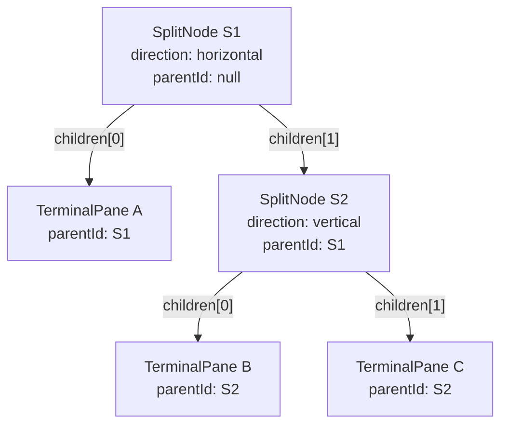
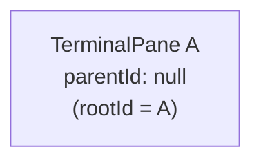
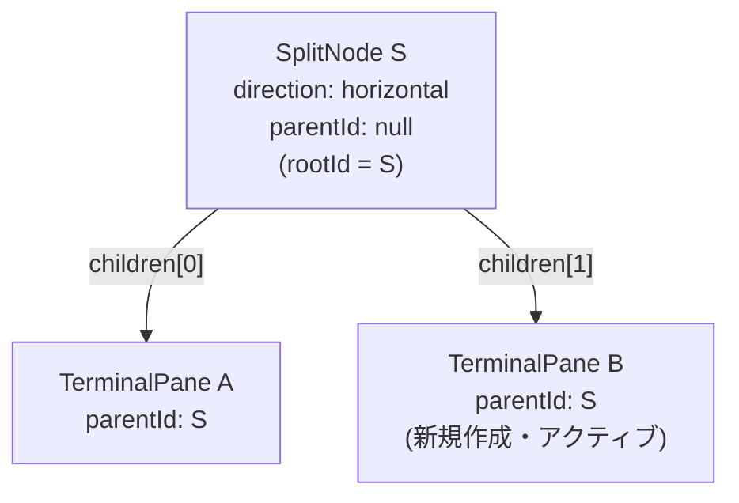
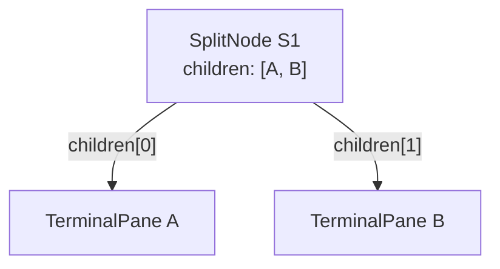
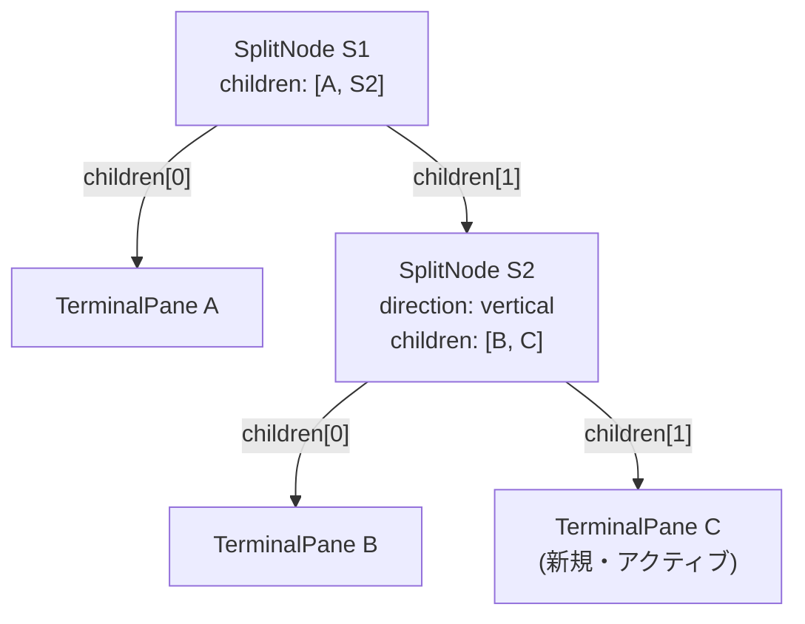
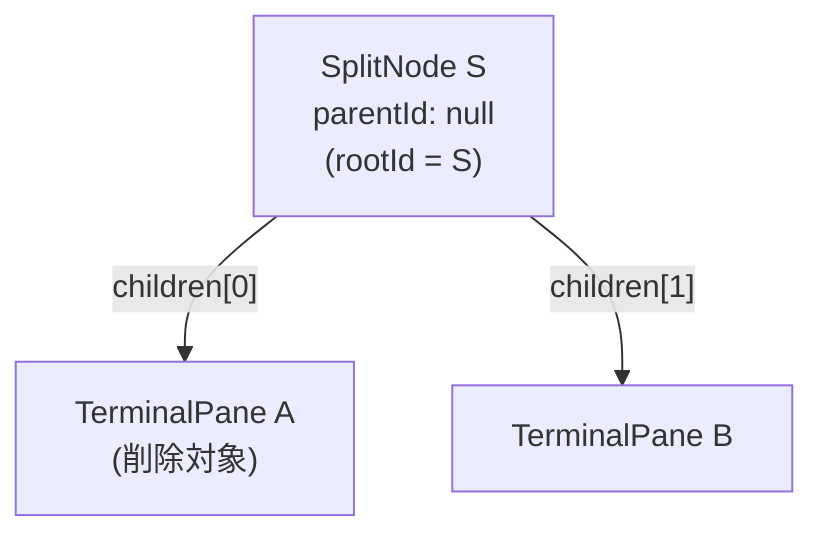
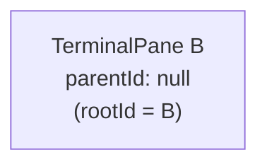
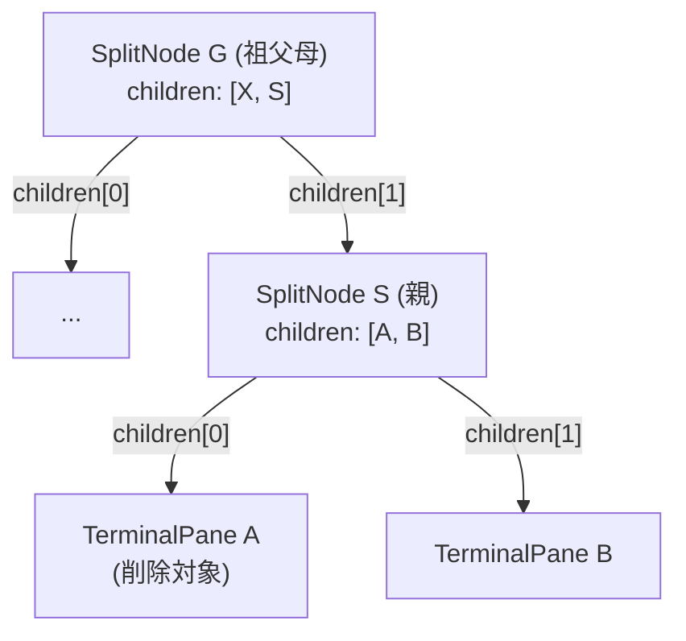
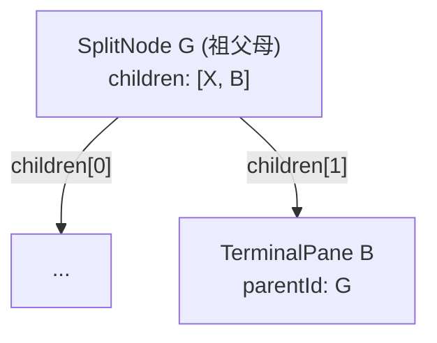
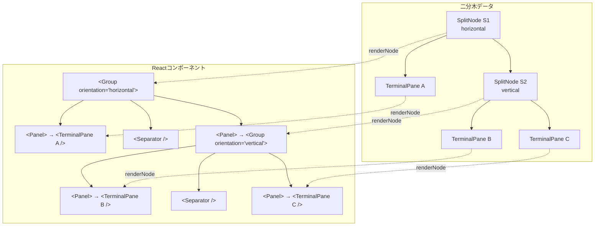

# レイアウト＆状態管理

> **前提知識**: [02-electron-basics.md](./02-electron-basics.md) / [01-architecture-overview.md](./01-architecture-overview.md)
>
> **関連ドキュメント**: [03-data-flow.md](./03-data-flow.md) | [05-advanced-features.md](./05-advanced-features.md)
>
> **本ドキュメントは重点領域です** — レイアウトの二分木データ構造と、Zustandによる状態管理の仕組みを詳細に解説します。

---

## レイアウトの基本概念

Terminal Divisionのペイン分割は、**二分木（Binary Tree）**で表現されます。ターミナルが画面にどう配置されるかを、2種類のノードで管理します。

### TerminalPane（葉ノード）

実際のターミナルを表す末端ノードです。xterm.jsのインスタンスと1対1で対応します。

```typescript
// src/renderer/types/layout.ts:3-6
export interface TerminalPane {
  id: string            // 一意のID（例: "pane-1706000000000-abc1234"）
  parentId: string | null  // 親ノードのID（ルートの場合はnull）
}
```

### SplitNode（内部ノード）

2つの子ノードを持つ分割ノードです。分割の方向と、どの2つのノードが含まれるかを管理します。

```typescript
// src/renderer/types/layout.ts:8-14
export interface SplitNode {
  id: string              // 一意のID
  type: 'split'           // ノード種別の判別用
  direction: SplitDirection  // 'horizontal'（左右分割）| 'vertical'（上下分割）
  children: string[]      // 子ノードのID配列（常に2要素）
  parentId: string | null // 親ノードのID
}
```

### 判別方法

`type`プロパティの有無でノード種別を判定します:

```typescript
// src/renderer/stores/terminalStore.ts:15-17
function isTerminalPane(node: LayoutNode): node is TerminalPane {
  return !('type' in node && node.type === 'split')
}
```

> **Note:** `TerminalPane`に`type`プロパティがない（`SplitNode`だけが`type: 'split'`を持つ）という非対称な設計です。TypeScriptのDiscriminated Unionとしてはやや特殊ですが、葉ノードをシンプルに保つための判断です。

---

## 二分木のデータ構造

全ノードは`Map<string, LayoutNode>`にフラットに格納されます。親子関係は`parentId`と`children`で表現します。

### 例: 3ターミナルの木構造

以下のようなレイアウトを考えます:

```
┌───────────┬───────────┐
│           │  Term B   │
│  Term A   ├───────────┤
│           │  Term C   │
└───────────┴───────────┘
```

このレイアウトに対応する二分木:



**Mapの中身:**

| キー | 値 |
|------|-----|
| `S1` | `{ id: "S1", type: "split", direction: "horizontal", children: ["A", "S2"], parentId: null }` |
| `A` | `{ id: "A", parentId: "S1" }` |
| `S2` | `{ id: "S2", type: "split", direction: "vertical", children: ["B", "C"], parentId: "S1" }` |
| `B` | `{ id: "B", parentId: "S2" }` |
| `C` | `{ id: "C", parentId: "S2" }` |

`rootId = "S1"`

> **Note:** フラットMapに格納する理由は、任意のノードにO(1)でアクセスできるためです。ネストされた木構造だと、特定ノードを見つけるためにツリー走査が必要になります。

---

## Zustandストアの構造

レイアウトの状態管理にはZustandを使用しています。`src/renderer/stores/terminalStore.ts`に定義されています。

### State（状態）

| プロパティ | 型 | 説明 |
|-----------|-----|------|
| `nodes` | `Map<string, LayoutNode>` | 全ノードのフラットMap |
| `rootId` | `string` | 木のルートノードID |
| `activeTerminalId` | `string \| null` | 現在フォーカス中のターミナルID |
| `terminalCount` | `number` | ターミナル総数（最大6） |

### Actions（操作）

| メソッド | 引数 | 説明 |
|---------|------|------|
| `setActiveTerminal` | `id: string \| null` | アクティブターミナルを変更 |
| `splitTerminal` | `terminalId, direction` | ターミナルを分割（後述） |
| `closeTerminal` | `terminalId` | ターミナルを閉じる（後述） |
| `getNode` | `id: string` | ノードを取得 |
| `canSplit` | なし | 分割可能か判定（`terminalCount < 6`） |

### Selector Hooks（再レンダリング最適化）

```typescript
// src/renderer/stores/terminalStore.ts:181-200
export const useActiveTerminalId = ()  => useTerminalStore((s) => s.activeTerminalId)
export const useTerminalCount = ()     => useTerminalStore((s) => s.terminalCount)
export const useRootId = ()            => useTerminalStore((s) => s.rootId)
export const useNodes = ()             => useTerminalStore((s) => s.nodes)
export const useCanSplit = ()          => useTerminalStore((s) => s.canSplit)

// Actions（安定した関数参照を返す）
export const useTerminalActions = () =>
  useTerminalStore(useShallow((s) => ({
    setActiveTerminal: s.setActiveTerminal,
    splitTerminal: s.splitTerminal,
    closeTerminal: s.closeTerminal,
    getNode: s.getNode
  })))
```

> **Note:** `useShallow`を使ってアクションのセレクターを作成しています。これにより、アクション関数の参照が変わらない限り再レンダリングが発生しません。

### 初期状態

アプリ起動時、ターミナル1つだけの状態からスタートします:

```typescript
// src/renderer/stores/terminalStore.ts:36-38
const initialTerminalId = generateId()
const initialNodes = new Map<string, LayoutNode>()
initialNodes.set(initialTerminalId, { id: initialTerminalId, parentId: null })
// rootId = initialTerminalId, terminalCount = 1
```

---

## ペイン分割の詳細

`splitTerminal(terminalId, direction)` は、既存のターミナルを2つに分割する操作です。2つのケースがあります。

### ケース1: ルートノードの分割

ターミナルが1つしかない（= ルートがTerminalPane）状態で分割する場合。

**Before:**


**After（horizontal分割）:**


**アルゴリズム（`src/renderer/stores/terminalStore.ts:50-88`）:**

1. 新しいTerminalPane B を作成（`parentId: newSplitId`）
2. 新しいSplitNode S を作成（`children: [A, B]`, `parentId: null`）
3. 既存のTerminalPane A の`parentId`を`null` → `S`に更新
4. `rootId`を`A` → `S`に変更
5. `terminalCount`を+1
6. `activeTerminalId`を新しいBに変更

### ケース2: 子ノードの分割

既にSplitNodeがある状態で、子のTerminalPaneを分割する場合。

**Before:**


**After（Bをvertical分割）:**


**アルゴリズム（`src/renderer/stores/terminalStore.ts:89-107`）:**

1. 新しいTerminalPane C を作成
2. 新しいSplitNode S2 を作成（`children: [B, C]`）
3. 既存のTerminalPane B の`parentId`をS1 → S2に更新
4. 親SplitNode S1の`children`内で、Bの位置をS2に差し替え
5. `terminalCount`を+1、`activeTerminalId`をCに変更

### ID生成

```typescript
// src/renderer/stores/terminalStore.ts:32-34
function generateId(): string {
  return `pane-${Date.now()}-${Math.random().toString(36).slice(2, 9)}`
}
```

タイムスタンプ + ランダム文字列で、十分にユニークなIDを生成します。

---

## ペイン削除の詳細

`closeTerminal(terminalId)` は、ターミナルを閉じて木構造を整理する操作です。削除時は「兄弟ノードの昇格」が行われます。

### 前提

- 最後の1つのターミナルは閉じられない（`terminalCount === 1`のとき`return`）
- 閉じる前に`terminalManager.destroy()`とIPCの`pty:kill`を呼んでクリーンアップ

### ケース1: 親がルートの場合（兄弟がルートに昇格）

**Before:**


**After:**


**アルゴリズム（`src/renderer/stores/terminalStore.ts:130-151`）:**

1. TerminalPane A をMapから削除
2. 親SplitNode S をMapから削除
3. 兄弟ノード B の`parentId`を`null`に更新（ルートに昇格）
4. `rootId`をBに変更
5. `terminalCount`を-1
6. 削除対象がアクティブだった場合、残りの最初のターミナルをアクティブにする

### ケース2: 親がルートでない場合（兄弟が祖父母に接続）

**Before:**


**After:**


**アルゴリズム（`src/renderer/stores/terminalStore.ts:152-174`）:**

1. TerminalPane A をMapから削除
2. 親SplitNode S をMapから削除
3. 祖父母SplitNode Gの`children`内で、Sの位置を兄弟Bに差し替え
4. 兄弟B の`parentId`をGに更新
5. `terminalCount`を-1

> **Note:** 兄弟ノードがSplitNode（サブツリー）の場合でも、同じロジックで動作します。兄弟サブツリー全体が祖父母に接続されます。

---

## レイアウトの画面描画

二分木データからReactコンポーネントに変換するのは `SplitContainer.tsx` の`renderNode`関数です。

### 再帰レンダリングの仕組み

```typescript
// src/renderer/components/SplitContainer.tsx:36-78
const renderNode = useCallback((nodeId: string): React.ReactNode => {
  const node = nodes.get(nodeId)
  if (!node) return null

  if ('type' in node && node.type === 'split') {
    // SplitNode → react-resizable-panelsのGroupを生成
    return (
      <Group orientation={splitNode.direction}>
        {splitNode.children.map((childId, index) => (
          <>
            <Panel>{renderNode(childId)}</Panel>  {/* 再帰呼び出し */}
            {index < splitNode.children.length - 1 && <Separator />}
          </>
        ))}
      </Group>
    )
  }

  // TerminalPane → TerminalPaneコンポーネントを生成
  return <TerminalPane id={node.id} />
}, [nodes])
```

### データ構造とコンポーネントの対応



### react-resizable-panelsの構成

| コンポーネント | 役割 | 設定 |
|--------------|------|------|
| `Group` | パネルグループのコンテナ | `orientation`: "horizontal" or "vertical" |
| `Panel` | リサイズ可能なパネル | `minSize: 10`（最小10%）, `defaultSize: 50%` |
| `Separator` | ドラッグ可能な仕切り | 水平: 4px幅、垂直: 4px高さ |

セパレーターのスタイルはCSSとインラインスタイルの両方で定義されています:
- `src/renderer/styles/globals.css:66-93` — `data-panel-resize-handle-id`属性セレクターで基本スタイル
- `src/renderer/components/SplitContainer.tsx:12-34` — ホバー時の`background-color`変化

---

## ユーティリティ関数

### isTerminalPane()

ノードが`TerminalPane`（葉ノード）かどうかを判定する型ガード関数です。`terminalStore.ts`と`layoutUtils.ts`の両方に定義があります。

```typescript
// src/renderer/utils/layoutUtils.ts:3-5
export function isTerminalPane(node: LayoutNode): node is TerminalPane {
  return !('type' in node && node.type === 'split')
}
```

### getAllTerminalIds()

全ターミナルIDをリストとして取得します。フォーカス移動（`App.tsx`の`moveFocus`）で使用されます。

```typescript
// src/renderer/utils/layoutUtils.ts:7-15
export function getAllTerminalIds(nodes: Map<string, LayoutNode>): string[] {
  const ids: string[] = []
  for (const [id, node] of nodes) {
    if (isTerminalPane(node)) {
      ids.push(id)
    }
  }
  return ids
}
```

### generateId()

ペイン用のユニークIDを生成します。`Date.now()`と`Math.random()`の組み合わせです。

```typescript
// src/renderer/stores/terminalStore.ts:32-34
function generateId(): string {
  return `pane-${Date.now()}-${Math.random().toString(36).slice(2, 9)}`
}
```

> **Note:** UUIDライブラリを使わない軽量な実装です。同一ミリ秒で生成された場合でもランダム部分で衝突を回避します。

---

## まとめ

| 概念 | 実装 | ファイル |
|------|------|---------|
| レイアウトデータ | 二分木（フラットMap） | `terminalStore.ts` |
| ノード型定義 | TerminalPane / SplitNode | `layout.ts` |
| 状態管理 | Zustand store | `terminalStore.ts` |
| 再帰レンダリング | renderNode() | `SplitContainer.tsx` |
| リサイズUI | react-resizable-panels | `SplitContainer.tsx` |
| ユーティリティ | isTerminalPane, getAllTerminalIds | `layoutUtils.ts` |

次は [03-data-flow.md](./03-data-flow.md) で、このレイアウト構造の上で実際にデータがどう流れるかを解説します。
