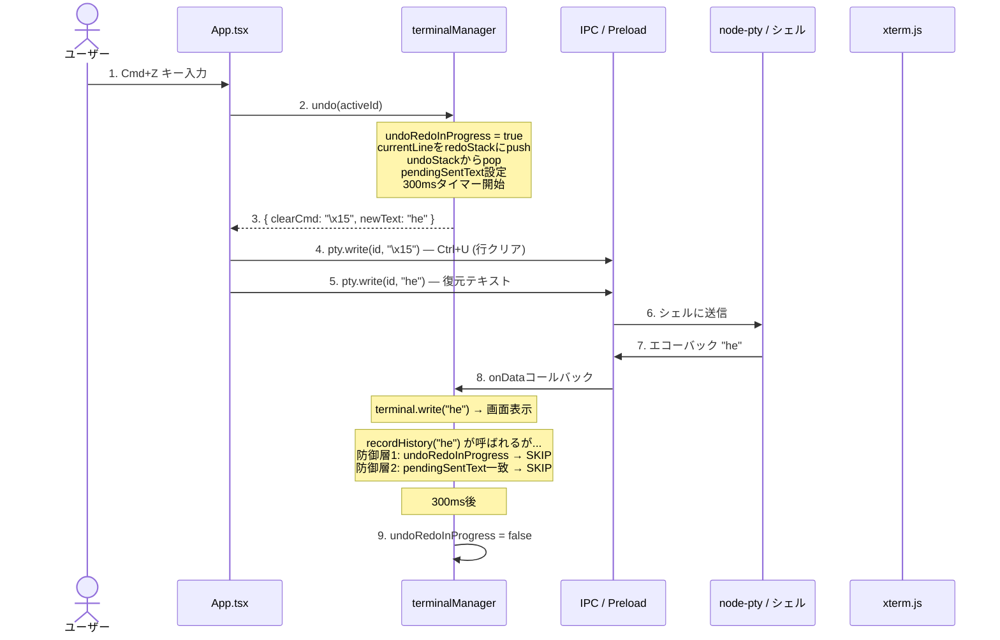
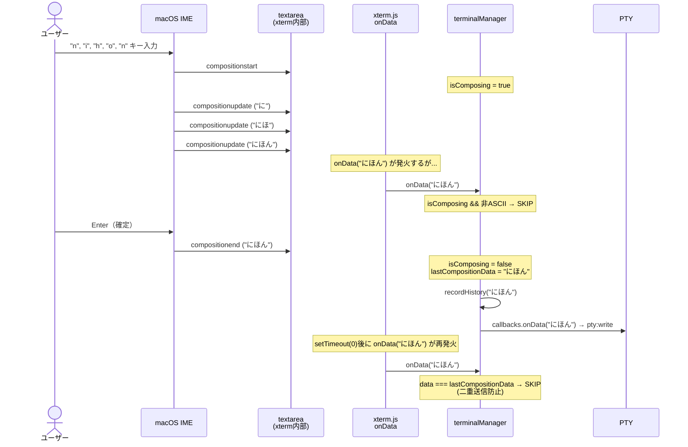

# 高度な機能

> **前提知識**: [02-electron-basics.md](./02-electron-basics.md) / [03-data-flow.md](./03-data-flow.md) / [04-layout-and-state.md](./04-layout-and-state.md)
>
> **関連ドキュメント**: [01-architecture-overview.md](./01-architecture-overview.md)

本ドキュメントでは、Terminal Divisionの中で特に実装が複雑な3つの機能を解説します:

1. **Undo/Redo** — ターミナル入力の履歴管理とエコーバック防止
2. **IME（日本語入力）** — xterm.jsとIMEコンポジションの競合解決
3. **ショートカットキー** — キャプチャフェーズによるキー横取り

---

## Undo/Redo

### データ構造

各ターミナルインスタンスが`InputHistoryState`を持ちます。

```typescript
// src/renderer/services/terminalManager.ts:6-10
interface InputHistoryState {
  undoStack: string[]   // 過去の入力状態（最大100エントリ）
  redoStack: string[]   // undoで戻した状態
  currentLine: string   // 現在の入力行
}
```

**スタックの動き（例）:**

```
操作                  undoStack        currentLine    redoStack
─────────────────────────────────────────────────────────────
初期状態              []               ""             []
"h" 入力              [""]             "h"            []
"e" 入力              ["", "h"]        "he"           []
"l" 入力              ["", "h", "he"]  "hel"          []
Undo (Cmd+Z)          ["", "h"]        "he"           ["hel"]
Undo (Cmd+Z)          [""]             "h"            ["hel", "he"]
Redo (Cmd+Shift+Z)    ["", "h"]        "he"           ["hel"]
"x" 入力              ["", "h", "he"]  "hex"          []  ← redoクリア
```

> **Note:** スタックサイズは`MAX_UNDO_STACK_SIZE = 100`で制限されています。超過時は最古のエントリが`shift()`で削除されます（`src/renderer/services/terminalManager.ts:119-121`）。

### 履歴記録 — recordHistory()

`recordHistory()`は、入力の種類に応じて`currentLine`を更新し、以前の状態をundoStackにpushします。

```typescript
// src/renderer/services/terminalManager.ts:129-184 — terminal.onData内
// 入力種別ごとの処理:

if (data === '\r' || data === '\n') {
  // Enter → 行確定: 履歴をリセット
  inputHistory.undoStack = []
  inputHistory.redoStack = []
  inputHistory.currentLine = ''
}
else if (data === '\x7f' || data === '\b') {
  // Backspace → 最後の1文字を削除
  recordHistory(inputHistory.currentLine.slice(0, -1))
}
else if (data === '\x17') {
  // Ctrl+W → 最後の単語を削除
  recordHistory(inputHistory.currentLine.replace(/\s*\S+\s*$/, ''))
}
else if (data === '\x15') {
  // Ctrl+U → 行全体を削除
  recordHistory('')
}
else if (!isControlChar(data)) {
  // 通常入力 → 文字を追加
  recordHistory(inputHistory.currentLine + data)
}
```

### Undo操作フロー

Cmd+Zが押されてから、画面表示が更新されるまでの全サイクルです。**エコーバック防止**が最も複雑な部分です。



### エコーバック防止 — 3層防御

ターミナルのUndo/Redoで最も難しい問題は**エコーバック**です。Undo操作でPTYにテキストを送ると、シェルがそのテキストをそのまま返してきます。このエコーバックを`recordHistory()`が「新しい入力」として記録してしまうと、履歴が壊れます。

Terminal Divisionでは3つの防御層でこれを解決しています:

**防御層1: `undoRedoInProgress`フラグ**

```typescript
// src/renderer/services/terminalManager.ts:94-98
if (undoRedoInProgress.get(id)) {
  console.log('[recordHistory] SKIPPED (undo/redo in progress)')
  return  // エコーバック期間中は履歴記録をスキップ
}
```

Undo/Redo操作の開始時にフラグをtrueに設定し、300ms後にfalseに戻します。この間に受信した全データは履歴に記録されません。

**防御層2: `pendingSentText`による文字列マッチ**

```typescript
// src/renderer/services/terminalManager.ts:100-106
const pending = pendingSentText.get(id)
if (pending !== undefined && pending === newLine) {
  console.log('[recordHistory] SKIPPED (matches pending sent text)')
  pendingSentText.delete(id)
  return  // 送信したテキストと一致 → エコーバックと判断
}
```

Undo/Redoで送信したテキストを記録しておき、`recordHistory`に同じテキストが来たらスキップします。フラグが早くリセットされた場合のセーフティネットです。

**防御層3: 300msタイマー（パッケージ版対応）**

```typescript
// src/renderer/services/terminalManager.ts:465-470
const timer = setTimeout(() => {
  undoRedoInProgress.set(id, false)
  undoRedoTimers.delete(id)
}, 300)  // パッケージ版ではエコーバックが遅い可能性があるため300ms
undoRedoTimers.set(id, timer)
```

> **Note:** 開発版（`electron-vite dev`）ではエコーバックが数ms以内に返りますが、パッケージ版（`.app`バンドル）ではIPC経路が長くなり遅延が大きくなることがあります。300msはこの遅延を考慮した値です。

**タイマーキャンセル（連続操作時）:**

```typescript
// src/renderer/services/terminalManager.ts:456-461
const existingTimer = undoRedoTimers.get(id)
if (existingTimer) {
  clearTimeout(existingTimer)  // 古いタイマーをキャンセル
}
```

連続してUndo/Redoを実行した場合、古い300msタイマーが先にフラグをfalseに戻してしまう問題を防ぎます。新しいタイマーだけが生き残ります。

---

## IME（日本語入力）

### 問題の背景

xterm.jsは元々ASCII入力向けに設計されており、IME（Input Method Editor）によるコンポジション入力と相性が悪い点があります。

**具体的な問題:**
1. IMEコンポジション中に、xterm.jsの`onData`が非ASCII文字を中間状態で送信してしまう
2. `compositionend`で確定したテキストを送信した後、xterm.jsが`setTimeout(0)`で同じテキストを再送信する（二重送信）

### IMEイベントフロー

日本語で「日本」と入力する場合のイベントフローです:



### 実装の詳細

**1. Compositionイベントリスナー** (`src/renderer/services/terminalManager.ts:200-230`)

xterm.js内部の`<textarea>`要素にcompositionイベントリスナーを直接追加します:

```typescript
textarea.addEventListener('compositionstart', () => {
  isComposing = true
  lastCompositionData = null
})

textarea.addEventListener('compositionend', (e: CompositionEvent) => {
  isComposing = false
  if (e.data && e.data.length > 0) {
    lastCompositionData = e.data     // 二重送信防止用に記録
    recordHistory(currentLine + e.data)  // 履歴に記録
    callbacks.onData(e.data)         // PTYに送信
  }
})
```

**2. onData内のフィルタリング** (`src/renderer/services/terminalManager.ts:142-153`)

```typescript
terminal.onData((data) => {
  // コンポジション中の非ASCII文字をスキップ（中間状態の誤送信を防止）
  if (isComposing && /[^\x00-\x7F]/.test(data)) {
    return  // SKIP
  }

  // compositionendで送信済みのデータと重複する場合スキップ
  if (lastCompositionData !== null && data === lastCompositionData) {
    lastCompositionData = null
    return  // SKIP
  }
  lastCompositionData = null

  // 通常処理...
})
```

> **Note:** `isComposing`チェックで**非ASCII文字のみ**をスキップしている理由は、IMEコンポジション中でも矢印キーやBackspace（ASCII制御文字）は処理する必要があるためです。

**3. 登録タイミング** (`src/renderer/services/terminalManager.ts:328-335`)

compositionリスナーは`attachToContainer()`の中で、DOMにアタッチされた後に一度だけ登録されます:

```typescript
if (!instance.compositionRegistered) {
  registerCompositionListeners()
  instance.compositionRegistered = true
}
```

---

## ショートカットキー

### キャプチャフェーズの仕組み

xterm.jsは`<textarea>`でキーイベントを処理します。ショートカットキーをxterm.jsより先に処理するため、`window`レベルで**キャプチャフェーズ**のリスナーを登録しています。

```
DOMイベントの伝播順序:

  キャプチャフェーズ（上→下）     バブリングフェーズ（下→上）
  ┌──────────┐                ┌──────────┐
  │ window    │ ← ここで処理   │ window   │
  ├──────────┤                ├──────────┤
  │ document  │                │ document │
  ├──────────┤                ├──────────┤
  │ div#root  │                │ div#root │
  ├──────────┤                ├──────────┤
  │ textarea  │ ← xterm.jsの   │ textarea │
  └──────────┘   リスナーはここ  └──────────┘
```

```typescript
// src/renderer/App.tsx:264
window.addEventListener("keydown", handleKeyDown, true)
//                                                ^^^^ true = キャプチャフェーズ
```

ショートカットに該当するキーは`e.preventDefault()` + `e.stopPropagation()`でxterm.jsへの到達を阻止します。

### IMEコンポジション中のスキップ

ショートカットハンドラーの先頭で、IME変換中かどうかを判定しています:

```typescript
// src/renderer/App.tsx:51-53
if (e.isComposing || e.keyCode === 229) {
  return  // IME変換中はショートカットを処理しない
}
```

> **Note:** `keyCode === 229`は、ブラウザがIMEコンポジション中のキー入力に対して設定する特別な値です。`isComposing`と併用することで確実にIME中を検出します。

### ショートカット一覧

| キー | 動作 | 制御シーケンス | 実装箇所 |
|------|------|--------------|---------|
| `Cmd+D` | 縦分割（horizontal） | — | `App.tsx:60` |
| `Cmd+Shift+D` | 横分割（vertical） | — | `App.tsx:69` |
| `Cmd+W` | ペインを閉じる | — | `App.tsx:105` |
| `Cmd+Z` | Undo | `\x15` + 復元テキスト | `App.tsx:138` |
| `Cmd+Shift+Z` | Redo | `\x15` + 復元テキスト | `App.tsx:155` |
| `Cmd+Backspace` | 行全体を削除 | `\x05` + `\x15` | `App.tsx:114` |
| `Cmd+K` | カーソル以降を削除 | `\x0b` | `App.tsx:129` |
| `Cmd+←` | 行の先頭へ | `\x01` (Ctrl+A) | `App.tsx:171` |
| `Cmd+→` | 行の末尾へ | `\x05` (Ctrl+E) | `App.tsx:180` |
| `Cmd+Shift+Arrow` | 現在行を選択 | — | `App.tsx:78` |
| `Cmd+Shift+A` | 現在行を選択 | — | `App.tsx:95` |
| `Option+←` | 単語単位で左移動 | `\x1bb` (ESC+b) | `App.tsx:211` |
| `Option+→` | 単語単位で右移動 | `\x1bf` (ESC+f) | `App.tsx:220` |
| `Option+Backspace` | 単語を後方削除 | `\x17` (Ctrl+W) | `App.tsx:201` |
| `Option+D` | 単語を前方削除 | `\x1bd` (ESC+d) | `App.tsx:231` |
| `Shift+Enter` | 改行を挿入 | `\n` | `App.tsx:191` |
| `Cmd+Option+Arrow` | フォーカス移動 | — | `App.tsx:241` |

### フォーカス移動のロジック

`Cmd+Option+矢印`でペイン間をフォーカス移動します。`moveFocus()`は`getAllTerminalIds()`で取得したID配列を循環的にナビゲートします:

```typescript
// src/renderer/App.tsx:27-46
const moveFocus = useCallback((direction: "up" | "down" | "left" | "right") => {
  const currentIndex = terminalIds.indexOf(activeTerminalId)
  let nextIndex: number
  if (direction === "left" || direction === "up") {
    nextIndex = currentIndex > 0 ? currentIndex - 1 : terminalIds.length - 1
  } else {
    nextIndex = currentIndex < terminalIds.length - 1 ? currentIndex + 1 : 0
  }
  setActiveTerminal(terminalIds[nextIndex])
}, [terminalIds, activeTerminalId, setActiveTerminal])
```

> **Note:** 現在の実装は空間的な位置関係ではなく、ID配列の順序に基づく単純な循環です。left/upで前のIDへ、right/downで次のIDへ移動します。

---

## terminalManagerのライフサイクル

`terminalManager`はReactの外部（モジュールスコープ）で管理されるxterm.jsインスタンスのレジストリです。

### なぜモジュールスコープなのか

React StrictModeやコンポーネントの再レンダリングによって、`useEffect`のクリーンアップと再実行が発生します。xterm.jsインスタンスやIPCリスナーをReactの状態として管理すると、再レンダリングのたびに破棄と再作成が繰り返されてしまいます。

モジュールスコープの`Map`に格納することで:
- Reactのライフサイクルに依存しない安定した参照
- `getOrCreate()`パターンで重複作成を防止
- リスナーの多重登録を確実に回避

```typescript
// src/renderer/services/terminalManager.ts:26
const registry = new Map<string, TerminalInstance>()
```

### getOrCreateパターン

```typescript
// src/renderer/services/terminalManager.ts:48-57
export function getOrCreate(id, options, callbacks): TerminalInstance {
  const existing = registry.get(id)
  if (existing) {
    return existing  // 既存インスタンスを返す（リスナー再登録なし）
  }
  // 新規作成: Terminal + FitAddon + リスナー登録
  // ...
  registry.set(id, instance)
  return instance
}
```

### TerminalInstance構造

```typescript
// src/renderer/services/terminalManager.ts:15-23
export interface TerminalInstance {
  terminal: Terminal           // xterm.jsインスタンス
  fitAddon: FitAddon          // サイズ自動調整アドオン
  ptyCreated: boolean         // PTYが生成済みかどうか
  compositionRegistered: boolean  // IMEリスナーが登録済みか
  dataListenerRemover: (() => void) | null   // データリスナーの解除関数
  exitListenerRemover: (() => void) | null   // 終了リスナーの解除関数
  inputHistory: InputHistoryState   // Undo/Redo用の入力履歴
}
```

### クリーンアップ

`destroy()`は以下の順序でリソースを解放します（`src/renderer/services/terminalManager.ts:277-303`）:

1. IPCリスナー解除 (`dataListenerRemover`, `exitListenerRemover`)
2. xterm.js dispose (`terminal.dispose()`)
3. Registryから削除 (`registry.delete(id)`)
4. Undo/Redoフラグとタイマーのクリア
5. 送信済みテキスト追跡のクリア

> **Note:** TerminalPaneコンポーネントのクリーンアップ（`useEffect`の返り値）では`destroy()`を**呼びません**。ResizeObserverの切断と`detachFromContainer()`のみを行います。`destroy()`は`closeTerminal()`（Zustandストア）からのみ呼ばれます。これにより、React StrictModeの二重実行でターミナルが破棄されることを防いでいます。

---

## まとめ

| 機能 | 核心的な課題 | 解決策 |
|------|------------|--------|
| Undo/Redo | PTYエコーバックによる履歴汚染 | 3層防御（フラグ + 文字列マッチ + タイマー） |
| IME入力 | xterm.jsとの二重送信・中間状態の漏洩 | compositionイベント直接処理 + dedup |
| ショートカット | xterm.jsがキーを横取りする | キャプチャフェーズでの先行処理 |
| terminalManager | Reactライフサイクルとの分離 | モジュールスコープ + getOrCreateパターン |
